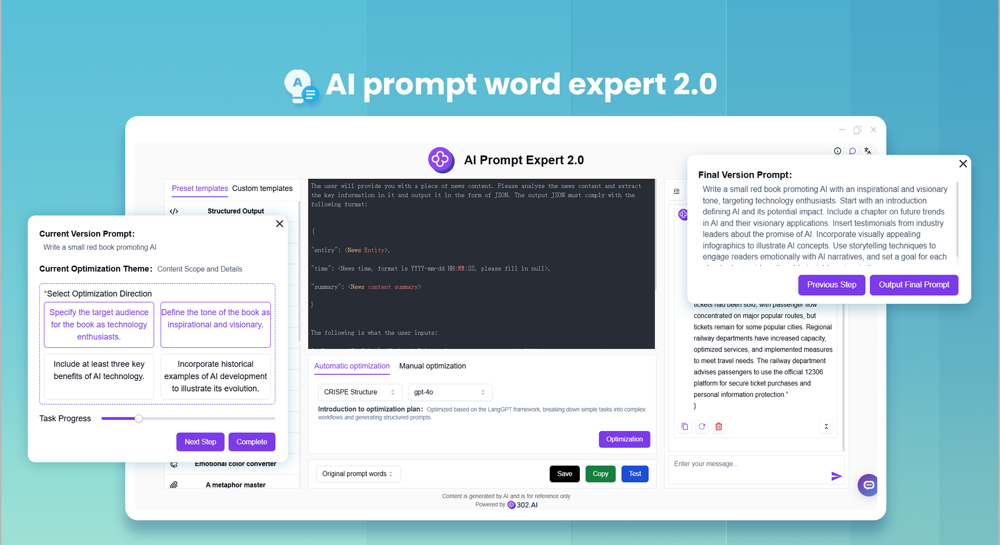
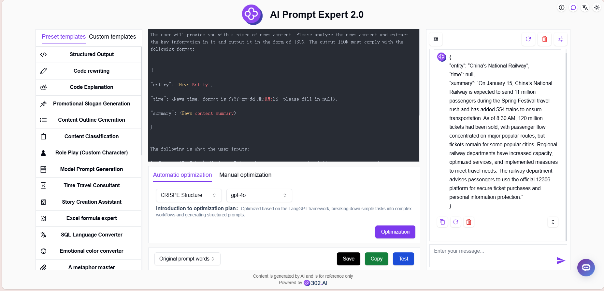
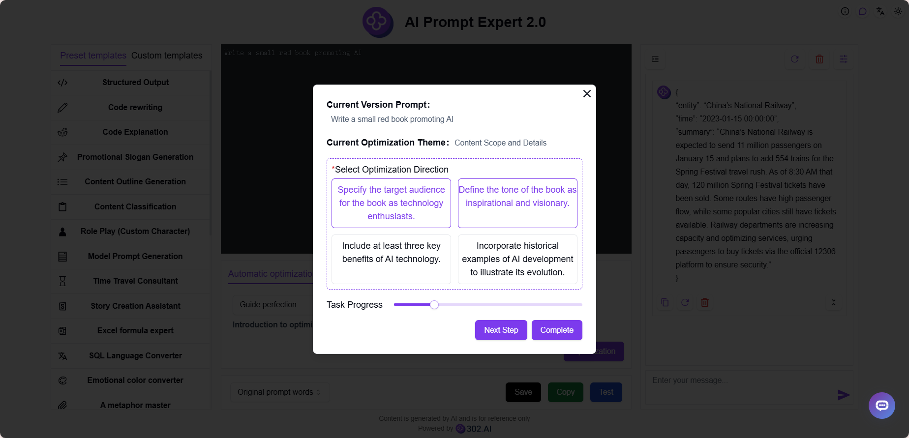
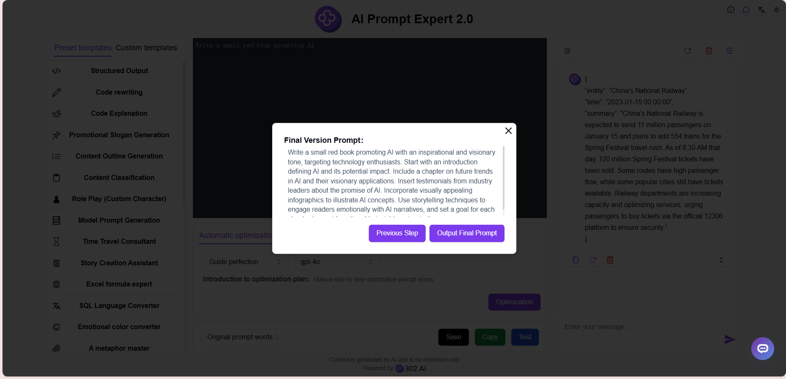

# <p align="center">🤖 AI Prompt Expert 2.0 🚀✨</p>

<p align="center">AI Prompt Expert 2.0 generates professional prompts from simple descriptions, offering multiple preset and custom templates to choose from, with online optimization and testing capabilities, and AI-guided refinement for step-by-step prompt optimization.</p>

<p align="center"><a href="https://302.ai/product/detail/60" target="blank"></a></p >

<p align="center"><a href="README_zh.md">中文</a> | <a href="README.md">English</a> | <a href="README_ja.md">日本語</a></p>



The open-source version of [AI Prompt Expert 2.0](https://302.ai/product/detail/60) from [302.AI](https://302.ai/en/).
You can directly log in to 302.AI to use the online version with zero code and zero configuration.
Or modify this project according to your needs, input 302.AI's API KEY, and deploy it yourself.

## Interface Preview
Simply input a basic description, and AI will generate high-quality prompts with support for online optimization and testing. Multiple preset and custom templates are available to meet your needs.
      

You can refine prompts through AI guidance, optimizing them step by step manually.
        

When AI determines that the current prompt has reached its highest quality, it will output the final prompt.



## Project Features
### ⚡ Multiple Optimization Solutions
- Supports 12 different prompt optimization solutions and provides customizable optimization framework capabilities
### 🔄 Optimization Features
- Automatic optimization: Provides multiple optimization solutions and models
- Manual optimization: Manually input desired modifications
### 🧪 Testing Features
- Online testing: Directly test prompt effectiveness
### 🤖 AI Guide Refinement
- Based on simple descriptions, manually optimize prompts step by step to generate professional prompts
### 📑 Prompt Templates
- Preset templates: Provides a rich library of preset templates
- Custom templates: Save personally frequently used prompts
### 🌍 Multi-language Support
- Chinese Interface
- English Interface
- Japanese Interface

## 🚩 Future Update Plans 
- [ ] Add more optimization solutions
- [ ] Add more preset templates

## 🛠️ Tech Stack

- **Framework**: Next.js 14
- **Language**: TypeScript
- **Styling**: TailwindCSS
- **UI Components**: Radix UI
- **State Management**: Jotai
- **Form Handling**: React Hook Form
- **HTTP Client**: ky
- **i18n**: next-intl
- **Theming**: next-themes
- **Code Standards**: ESLint, Prettier
- **Commit Standards**: Husky, Commitlint

## Development & Deployment
1. Clone the project
```bash
git clone https://github.com/302ai/302_prompt_expert
cd 302_prompt_expert
```

2. Install dependencies
```bash
pnpm install
```

3. Configure environment
```bash
cp .env.example .env.local
```
Modify the environment variables in `.env.local` as needed.

4. Start development server
```bash
pnpm dev
```

5. Build for production
```bash
pnpm build
pnpm start
```


## ✨ About 302.AI ✨
[302.AI](https://302.ai/en/) is an enterprise-oriented AI application platform that offers pay-as-you-go services, ready-to-use solutions, and an open-source ecosystem.✨
1. 🧠 Comprehensive AI capabilities: Incorporates the latest in language, image, audio, and video models from leading AI brands.
2. 🚀 Advanced application development: We build genuine AI products, not just simple chatbots.
3. 💰 No monthly fees: All features are pay-per-use, fully accessible, ensuring low entry barriers with high potential.
4. 🛠 Powerful admin dashboard: Designed for teams and SMEs - managed by one, used by many.
5. 🔗 API access for all AI features: All tools are open-source and customizable (in progress).
6. 💡 Powerful development team: Launching 2-3 new applications weekly with daily product updates. Interested developers are welcome to contact us.
