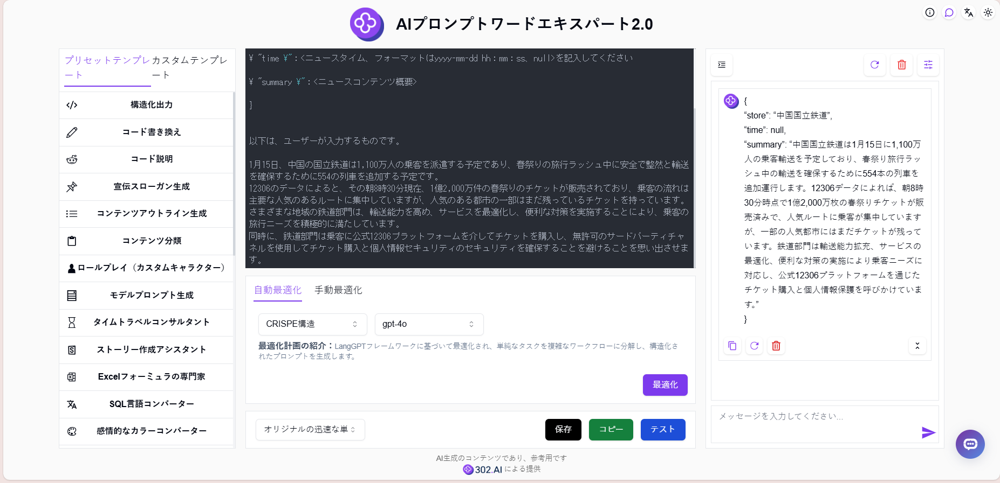
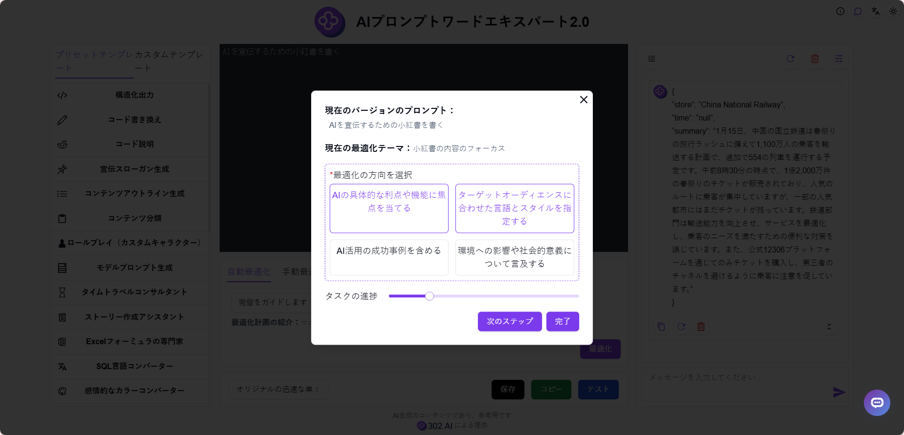
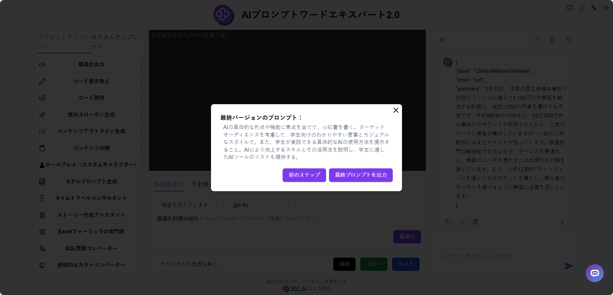

# <p align="center">🤖 AIプロンプトワードエキスパート2.0 🚀✨</p>

<p align="center">AIプロンプトワードエキスパート2.0は、シンプルな説明から専門的なプロンプトを生成し、複数のプリセットテンプレートとカスタムテンプレートを提供し、オンラインでの最適化とテストが可能で、AIガイドを使用してステップバイステップでプロンプトを改善することができます。</p>

<p align="center"><a href="https://302.ai/ja/tools/prompt/" target="blank"></a></p >

<p align="center"><a href="README_zh.md">中文</a> | <a href="README.md">English</a> | <a href="README_ja.md">日本語</a></p>


これは[302.AI](https://302.ai/ja/)の[AIプロンプトワードエキスパート2.0](https://302.ai/ja/tools/prompt/)のオープンソース版です。
302.AIに直接ログインして、コーディング不要で設定不要のオンラインバージョンをご利用いただけます。
また、このプロジェクトをご自身のニーズに合わせて修正し、302.AIのAPI KEYを設定して独自にデプロイすることも可能です。

## インターフェースプレビュー
簡単な説明を入力するだけで、AIが高品質なプロンプトを生成し、オンラインでの最適化とテストをサポートします。多様なプリセットテンプレートとカスタムテンプレートを提供し、あなたのニーズを満たします。
      

AIガイドを通じてプロンプトを改善し、手動でステップバイステップの最適化が可能です。
        

AIが現在のプロンプトが最高品質に達したと判断すると、最終プロンプトを出力します。


## プロジェクトの特徴
### ⚡ 複数の最適化ソリューション
- 12種類の異なるプロンプト最適化ソリューションをサポートし、カスタマイズ可能な最適化フレームワークを提供
### 🔄 最適化機能
- 自動最適化：複数の最適化ソリューションとモデルを提供
- 手動最適化：修正したい箇所を手動で入力
### 🧪 テスト機能
- オンラインテスト：プロンプトの効果を直接テスト
### 🤖 AIガイドによる改善
- 簡単な説明に基づき、手動でステップバイステップのプロンプト最適化を行い、最終的にプロフェッショナルなプロンプトを生成
### 📑 プロンプトテンプレート
- プリセットテンプレート：豊富なプリセットテンプレートライブラリを提供
- カスタムテンプレート：個人的によく使うプロンプトを保存
### 🌍 多言語サポート
- 中国語インターフェース
- 英語インターフェース
- 日本語インターフェース

## 🚩 将来のアップデート計画
- [ ] より多くの最適化ソリューションの追加
- [ ] より多くのプリセットテンプレートの追加

## 🛠️ 技術スタック

- **フレームワーク**: Next.js 14
- **言語**: TypeScript
- **スタイリング**: TailwindCSS
- **UIコンポーネント**: Radix UI
- **状態管理**: Jotai
- **フォーム処理**: React Hook Form
- **HTTPクライアント**: ky
- **国際化**: next-intl
- **テーマ**: next-themes
- **コード規約**: ESLint, Prettier
- **コミット規約**: Husky, Commitlint

## 開発&デプロイ
1. プロジェクトのクローン
```bash
git clone https://github.com/302ai/302_prompt_expert
cd 302_prompt_expert
```

2. 依存関係のインストール
```bash
pnpm install
```

3. 環境設定
```bash
cp .env.example .env.local
```
必要に応じて`.env.local`の環境変数を修正してください。

4. 開発サーバーの起動
```bash
pnpm dev
```

5. プロダクションビルド
```bash
pnpm build
pnpm start
```


## ✨ 302.AIについて ✨
[302.AI](https://302.ai/ja/)は企業向けのAIアプリケーションプラットフォームであり、必要に応じて支払い、すぐに使用できるオープンソースのエコシステムです。✨
1. 🧠 包括的なAI機能：主要AIブランドの最新の言語、画像、音声、ビデオモデルを統合。
2. 🚀 高度なアプリケーション開発：単なるシンプルなチャットボットではなく、本格的なAI製品を構築。
3. 💰 月額料金なし：すべての機能が従量制で、完全にアクセス可能。低い参入障壁と高い可能性を確保。
4. 🛠 強力な管理ダッシュボード：チームやSME向けに設計 - 一人で管理し、多くの人が使用可能。
5. 🔗 すべてのAI機能へのAPIアクセス：すべてのツールはオープンソースでカスタマイズ可能（進行中）。
6. 💪 強力な開発チーム：大規模で高度なスキルを持つ開発者集団。毎週2-3の新しいアプリケーションをリリースし、毎日製品更新を行っています。才能ある開発者の参加を歓迎します。