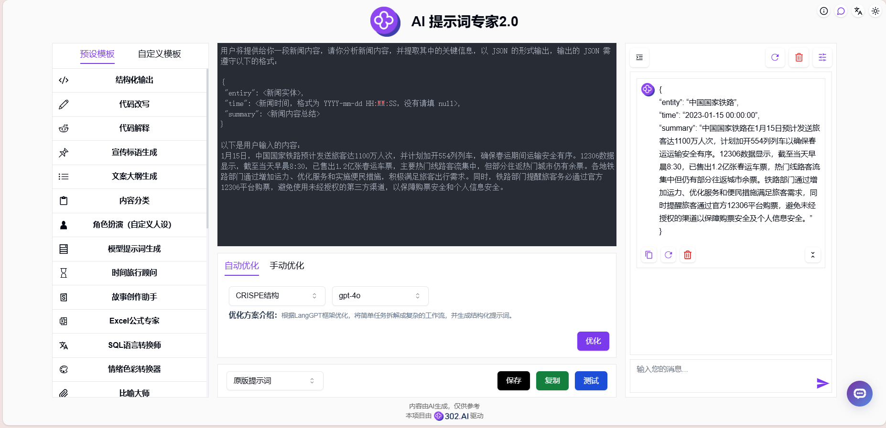
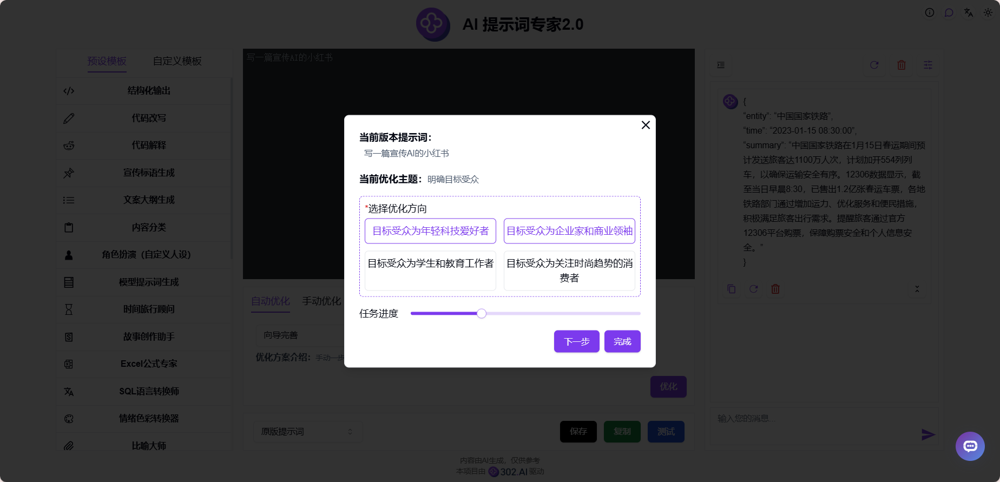
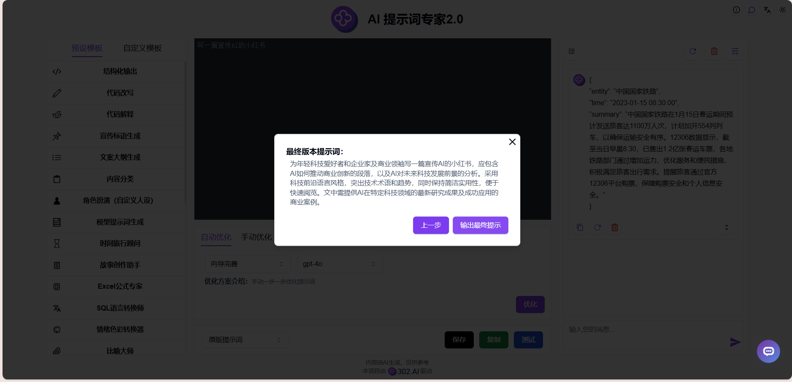

# <p align="center">🤖  AI 提示词专家2.0 🚀✨</p>

<p align="center">AI提示词专家2.0根据简单的描述生成专业的提示词，提供多种预设模板和自定义模板可选，并且可以在线优化和测试提示词效果，还可以使用AI向导完善，一步一步优化提示词。</p>

<p align="center"><a href="https://302.ai/tools/prompt/" target="blank"></a></p >

<p align="center"><a href="README_zh.md">中文</a> | <a href="README.md">English</a> | <a href="README_ja.md">日本語</a></p>


来自[302.AI](https://302.ai)的[AI 提示词专家2.0](https://302.ai/tools/prompt/)的开源版本。你可以直接登录302.AI，零代码零配置使用在线版本。或者对本项目根据自己的需求进行修改，传入302.AI的API KEY，自行部署。

## 界面预览
只需输入简单的描述，AI就能生成高质量的提示词，并且支持在线优化和测试提示词。提供多种预设模板和自定义模板可选，满足您的要求。
      

可通过AI向导完善提示词，手动一步一步优化提示词。
        

当AI认为当前提示词已达到最高质量，将会输出最终提示词。


## 项目特性
### ⚡ 多种优化方案
- 支持12种不同的提示词优化方案，提供自定义优化框架的能力
### 🔄 优化功能
- 自动优化：提供多种优化方案和模型
- 手动优化：手动输入需要修改的地方
### 🧪 测试功能
- 在线测试：直接测试提示词效果
### 🤖 AI向导完善
- 根据简单的描述，手动一步一步优化提示词，最终生成专业的提示词
### 📑 提示词模板
- 预设模板：提供丰富的预设模板库
- 自定义模板：保存个人常用提示词
### 🌍 多语言支持
- 中文界面
- English Interface
- 日本語インターフェース

## 🚩 未来更新计划
- [ ] 新增更多优化方案
- [ ] 新增更多预设模板

## 🛠️ 技术栈

- **框架**: Next.js 14
- **语言**: TypeScript
- **样式**: TailwindCSS
- **UI组件**: Radix UI
- **状态管理**: Jotai
- **表单处理**: React Hook Form
- **HTTP客户端**: ky
- **国际化**: next-intl
- **主题**: next-themes
- **代码规范**: ESLint, Prettier
- **提交规范**: Husky, Commitlint

## 开发&部署
1. 克隆项目
```bash
git clone https://github.com/302ai/302_prompt_expert
cd 302_prompt_expert
```

2. 安装依赖
```bash
pnpm install
```

3. 环境配置
```bash
cp .env.example .env.local
```
根据需要修改 `.env.local` 中的环境变量。

4. 启动开发服务器
```bash
pnpm dev
```

5. 构建生产版本
```bash
pnpm build
pnpm start
```

## ✨ 302.AI介绍 ✨
[302.AI](https://302.ai)是一个面向企业的AI应用平台，按需付费，开箱即用，开源生态。✨
1. 🧠 集合了最新最全的AI能力和品牌，包括但不限于语言模型、图像模型、声音模型、视频模型。
2. 🚀 在基础模型上进行深度应用开发，我们开发真正的AI产品，而不是简单的对话机器人
3. 💰 零月费，所有功能按需付费，全面开放，做到真正的门槛低，上限高。
4. 🛠 功能强大的管理后台，面向团队和中小企业，一人管理，多人使用。
5. 🔗 所有AI能力均提供API接入，所有工具开源可自行定制（进行中）。
6. 💡 强大的开发团队，每周推出2-3个新应用，产品每日更新。有兴趣加入的开发者也欢迎联系我们